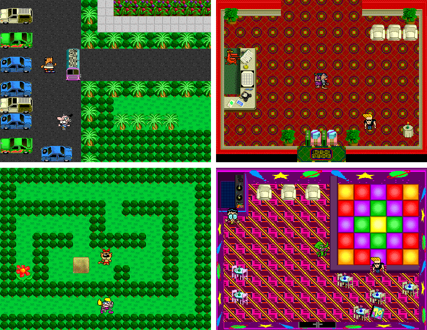

# Cartoon Cartoon Summer Resort

### **[Play it HERE in your Browser!](https://mattbruv.github.io/ccsr)**

This is a modern port of the Shockwave game series Cartoon Cartoon Summer Resort.

**Cartoon Cartoon Summer Resort** is the name of a series of four episodic Adventure Games formerly hosted on Cartoon Network's official website, featuring characters from their Cartoon Cartoons original programming. The game was created and released in summer 2000 tying in to the first Big Pick. Each playable character was from one of the shorts selected that could have become a full fleged series during the promotion.

As their name indicates, the games take place in a summer resort for Cartoon Cartoon characters. Each episode features a problem that threatens to disrupt our favorite animated friends' peaceful vacation, and it's up to you to solve it. Along the way, you will also need to help the guests with their own personal issues.
[\*](https://tvtropes.org/pmwiki/pmwiki.php/VideoGame/CartoonCartoonSummerResort)

## Features

This port aims to be as accurate as possible to the original game. Bugs in the original game exist in the remake, like the broken collision detection, random misplaced messages, etc.
Some quality of life features and improvements were also added.

- **High Resolution.** - The game now runs at full screen to fill your monitor's screen resolution. Graphics are upscaled to give nice crisp HD gampelay.
- **60+ FPS** - The game runs at the FPS rate of your monitor, with animations being interpolated to provide a smoother gameplay experience, as opposed to the original game's rough 12 FPS. (though this setting can be disabled if you enjoy horrible frame rates)
- **Translations** - The game currently supports English and Spanish, and can be translated to more languages if someone chooses to contribute a translation to their language in the future. Textures with English text are also translated.
- **New Camera Modes** - You can now experience the game in a new way with a camera that follows the player instead of panning between maps.

The port is written in [TypeScript](https://www.typescriptlang.org/),
using [PixiJS](https://pixijs.com/) as the 2D rendering engine, and [React](https://reactjs.org/) to render a simple web interface.

The [original game's code](https://github.com/mattbruv/ccsr-source) was decompiled using [ProjectorRays](https://github.com/ProjectorRays/ProjectorRays) and used as the base for this port.

## History

The series of games was developed by [Funny Garbage](https://www.linkedin.com/company/funny-garbage/) and published on the Cartoon Network website in the summer of 2000.
The games were made to run on the web via the Shockwave platform and were developed in Macromedia Director 7.
The early 2000s saw the decline in the usage of Director/Shockwave as most developers preferred using Flash. This technology was later bought by Adobe. After many years, in 2019 Adobe announced that Adobe Shockwave, including the Shockwave Player, would be discontinued.

With the death of Shockwave, this game inevitably died with it, until this port brought it new life once again.

It is still possible to play the original game in Shockwave form (and other Shockwave/Flash games) using software such as [Flashpoint](https://en.wikipedia.org/wiki/BlueMaxima's_Flashpoint).

## Why port this game?

You may be wondering why anyone would go through the effort to port this game to the modern web when it can still be played using Flashpoint. Well, there are many reasons as to why I think this game deserves a port:

- **It was designed to run in a web browser**
  - Flashpoint requires the user to install a program and sacrifice gigabytes of disk space to play a simple game. This is better than not being able to play it at all, but the original intention was for the user to open the browser and immediately start playing and having fun.
- **It is technically simple**
  - The original game's engine, source code, graphics, and gameplay are all straightforward and relatively simple to recreate. It is simple enough for one person to port it, so why not?
- **There is a lot of room for improvement**
  - The original game is littered with bugs, glitches, softlocks, and small oversights. There are also many quality of life features which can be added, such as individual sound settings, higher resolutions, framerates, and additional camera/panning settings just to name a few things.
- **It is nostalgic**
  - For me, (as with many others) this game takes me back to a simpler time in life. I have returned to this game in nostalgia trips, and I have even [reverse engineered and fixed bugs](https://mattbruv.github.io/ccsr-bugfix/) in the original game. The people who hold fond memories of this game deserve to be able to play it again.

## Special Thanks

**[ProjectorRays](https://github.com/ProjectorRays/ProjectorRays)**
\- Shockwave decompiler. lots of work has gone into developing this over the past few years, and their effort has made it possible to reverse engineer and extract the assets/source code of the original game. Without their hard work, this port wouldn't have been possible.

**[TheOnlyZac](https://github.com/TheOnlyZac)**
\- For creating the original [CCSR map viewer](https://github.com/TheOnlyZac/ccsr-map-viewer) and writing a series of articles on [TCRF](<https://tcrf.net/Cartoon_Cartoon_Summer_Resort_(Episode_1:_Pool_Problems)>) about CCSR. His work inspired the port and gave me the motivation to look into the game again.

**You**
\- For being a fan of this game, enjoying a nostalgic playthrough of this port and sharing it with others who want to play it, and reporting any bugs you may find.
