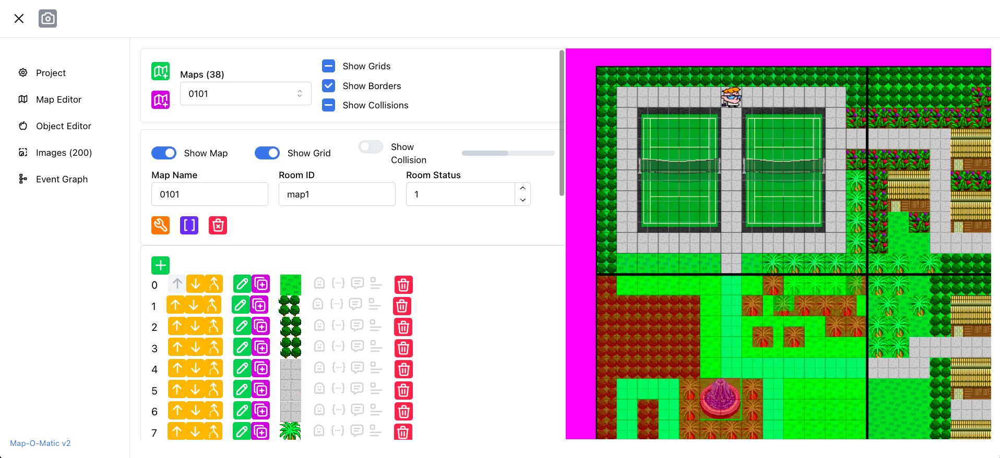

# Map-o-Matic-v2

Map-o-Matic-v2 is a fully featured map editor for games built on the Cartoon Cartoon Summer Resort engine.
It supports exporting map data which is completely compatible with both the original Shockwave games built in Macromedia Director and my modern port of the game, as both parse the map data in the same way.

## Features
* Load and explore projects for CCSR Episodes 1, 2, 3, 4, and Scooby Doo Hollywood Horror 1 & 2.
* Create and edit projects
* Create and edit maps
* Create and edit map objects, game events, and collision
* View collision maps
* View a flowchart of game events
* Export screenshots of the game world
* Manage texture images

## Development

Contributions are welcome, and encouraged. Feel free to open a PR for a feature, improvement, or bug fix. 

The map editor is built with [TypeScript](https://www.typescriptlang.org/),
[React](https://react.dev/),
[Mantine](https://mantine.dev/),
[pixi.js](https://pixijs.com/) for 2D rendering, 
and [Cytoscape.js](https://js.cytoscape.org/) for rendering the directed acyclic event graph.

It makes heavy use of the [immer](https://immerjs.github.io/immer/) library to easily produce edited copies of immutable state, instead of having to use spread syntax a billion times in deeply nested objects to create copies of state.

Setting up a development should be as easy as cloning this repo, and then running `npm install` and `npm run dev`.